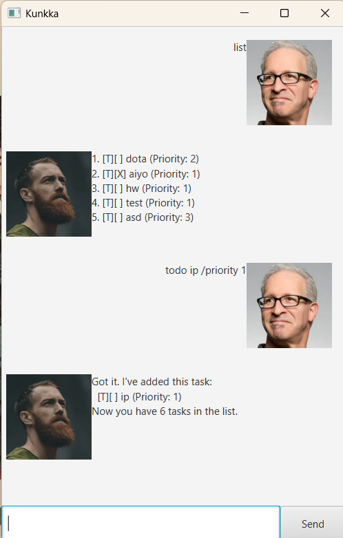

# Kunkka User Guide



Kunkka is not just another task manager; it's a personal assistant dedicated to helping you achieve your goals and make the most of your time. With a user-friendly interface and powerful features, Kunkka transforms your task management experience into something delightful and efficient.

## Adding todos:
Create a task with a description and priority level

Format: `todo [Description] /priority [Priority level (an arbitrary integer set by you)]`

Example: `todo homework /priority 1`

```
Got it. I've added this task:
  [T][ ] homework (Priority: 1)
Now you have 1 tasks in the list.
```

## Adding deadlines
Create a task with a deadline, description and priority level

Format: `deadline [Description] /by [Date] /priority [Priority level (an arbitrary integer set by you)]`

Example: `deadline ip /by 2025-02-24 /priority 1`

```
Got it. I've added this task:
[D][ ] ip (by: Feb 24 2025) (Priority: 1)
Now you have 2 tasks in the list.
```

## Adding events
Create a task with a begin date, end date, description and priority level

Format: `event [Description] /from [Begin Date] /to [End Date] /priority [Priority level (an arbitrary integer set by you)]`

Example: `event this year /from 2025-01-01 /to 2025-12-31 /priority 3`

```
Got it. I've added this task:
  [E][ ] this year (from: Jan 1 2025 to: Dec 31 2025) (Priority: 3)
Now you have 3 tasks in the list.
```

## Show all tasks
Display all task

Format: `list`

Output:

```
1. [T][ ] homework (Priority: 1)
2. [D][ ] ip (by: Feb 24 2025) (Priority: 1)
3. [E][ ] this year (from: Jan 1 2025 to: Dec 31 2025) (Priority: 3)
```

## Mark tasks
Mark tasks as done

Format: `mark [task index]`

Example: `mark 1`

```
Nice! I've marked this task as done:
  [T][X] homework (Priority: 1)
```

## Unmark tasks
Unmark done tasks as undone

Format `unmark [task index]`

Example: `unmark 1`

```
Nice! I've unmarked this task:
  [T][ ] homework (Priority: 1)
```

## Delete tasks
Remove tasks from your list

Format: `delete [task index]`

Example `delete 1`

```
Noted. I've removed this task:
[T][ ] homework (Priority: 1)
Now you have 2 tasks in the list.
```

## Find task
Find a task in your list

Format `find [key word]`

Example `find year`

```
[E][ ] this year (from: Jan 1 2025 to: Dec 31 2025) (Priority: 3)
```

## Find priority
Find all the tasks with a specific priority in your list

Format `find -p [priority]` or `find -priority [priority]`

Example `find -p 1`

```
Here are the tasks with priority 1:
[D][ ] ip (by: Feb 24 2025) (Priority: 1)
```

## Set priority
Change the priority of a task

Format `setpriority [task index] [new priority]`

Example `set 1 2`

```
Priority of task ip set to 2
```
